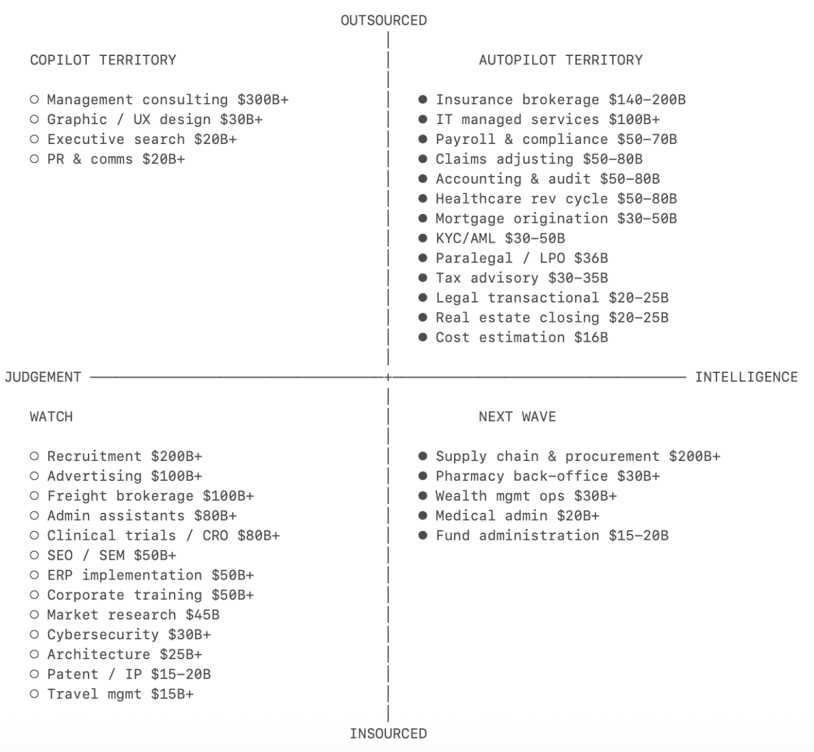

# 服务：新软件

**下一个万亿美元公司将是一家伪装成服务公司的软件公司。**

每个正在构建AI工具的创始人都在问同一个问题：当Claude的下一个版本让我的产品变成一个功能时，会发生什么？他们的担心是有道理的。如果你卖的是工具，你就在与模型赛跑。但如果你卖的是工作，模型的每一次改进都会让你的服务更快、更便宜、更难被竞争。

一家公司每年可能花1万美元购买QuickBooks，再花12万美元请会计师来结账。下一个传奇公司将直接帮你把账结了。

---

## 智能 vs 判断力

编写代码主要是**智能**。知道下一步该构建什么则是**判断力**。

将需求文档转化为代码、测试、调试：规则很复杂，但它们终究是规则。判断力则不同。它需要经验和品味，是多年实践积累的本能。决定下一个功能要做什么、是否承担技术债务、何时在产品准备好之前就发布。

一年前，大多数Cursor用户把AI当作自动补全。今天，由智能体发起的任务比人类发起的更多。软件工程占所有职业AI工具使用量的一半以上。其他每个类别都还是个位数。原因是软件工程主要是智能工作。AI已经跨越了门槛，可以自主完成大部分智能工作，把判断力留给人类。软件工程率先到达这一点。它正在来到每一个职业。

```
智能体部署在哪些领域？（工具调用百分比）

软件工程          |================================================== 49.7%
后台自动化          |========== 9.1%
其他              |======= 7.1%
营销和文案写作       |==== 4.4%
销售和CRM         |==== 4.3%
财务和会计          |==== 4.0%
数据分析和BI       |=== 3.5%
学术研究           |=== 2.8%
网络安全           |== 2.4%
客户服务           |== 2.2%
游戏和互动媒体       |== 2.1%
文档和演示文稿       |== 1.9%
教育和辅导          |= 1.8%
电商运营           |= 1.3%
医疗和保健          |= 1.0%
法律              |= 0.9%
差旅和物流          |= 0.8%
```

---

## 副驾驶与自动驾驶

**副驾驶卖的是工具。自动驾驶卖的是工作。**

直到最近，AI模型仍在发展智能和判断力，所以正确的方法是先从副驾驶开始：把AI交到专业人士手中，让他们决定如何使用它。Harvey卖给律师事务所。Rogo卖给投资银行。专业人士是客户，工具让他们更高效，他们对输出负责。

今天，模型已经足够智能，在某些类别中，最好的起点就是自动驾驶。Crosby卖给需要起草保密协议的公司，而不是卖给外部律师。WithCoverage卖给需要保险的CFO，而不是卖给保险经纪人。客户直接购买结果。任何职业的工作预算都远超工具预算，自动驾驶从第一天起就捕获工作预算。

任何领域的智能比例越高，自动驾驶就越早获胜。

---

## 融合

今天的判断力将成为明天的智能。随着AI系统积累关于其领域中良好判断力是什么样子的专有数据，前沿将发生转移。副驾驶和自动驾驶将融合。从副驾驶到自动驾驶的过渡已经在几个类别中开始。但起点很重要，因为它决定了自动驾驶现在可以在哪里赢得客户，并开始积累数据，最终让它们也能处理判断力。

---

## 自动驾驶手册：外包作为切入点

每花1美元在软件上，就有6美元花在服务上。

自动驾驶的总可寻址市场（TAM）是一个类别中的所有劳动力支出，包括内部和外包。但正确的起点是外包已经存在的地方。

如果一项任务已经外包，它告诉你三件事：
1. 公司已经接受这项工作可以外部完成
2. 存在可以干净替代的预算线
3. 买方已经在购买结果

用AI原生服务提供商替代外包合同是供应商替换。替代人头则是重组。

**手册**：公司应从外包的、智能密集型的任务开始。搞定分销。随着AI的积累，向内部的、判断力密集型的业务扩展。外包任务是切入点。内部工作是长期TAM。

Crosby从保密协议开始：一项定义明确的任务，主要是智能工作，大多数公司已经外包给外部律师。预算存在，范围明确，ROI立竿见影，替代无摩擦。

---

## 机会地图

将每个服务垂直领域绘制在智能-判断力光谱和外包-内部比例上，就产生了一个优先级地图（括号内为劳动力TAM）。该列表具有说明性。

```
                    外包
                      |
  副驾驶领域            |            自动驾驶领域
                      |
  ○ 管理咨询 $300B+    |    ● 保险经纪 $140-200B
  ○ 图形/UX设计 $30B+   |    ● IT托管服务 $100B+
  ○ 高管搜索 $20B+     |    ● 薪资与合规 $50-70B
  ○ 公关传播 $20B+     |    ● 理赔调整 $50-80B
                      |    ● 会计与审计 $50-80B
                    |     ● 医疗收入周期 $50-80B
                        |    ● 抵押贷款发起 $30-50B
                      |    ● KYC/AML $30-50B
                        |    ● 律师助理/LPO $36B
                      |    ● 税务咨询 $30-35B
                    |    ● 法律交易 $20-25B
                    |    ● 房地产交割 $20-25B
                    |    ● 成本估算 $16B
  判断力 ————————————————+———————————————— 智能
                      |     
  观察区               |     
                      |   
  ○ 招聘 $200B+        |   
  ○ 广告 $100B+        |     
  ○ 货运经纪 $100B+    |     
  ○ 行政助理 $80B+     |     
  ○ 临床试验/CRO $80B+ |     
  ○ SEO/SEM $50B+      |
  ○ ERP实施 $50B+      |    下一波
  ○ 企业培训 $50B+     |
  ○ 市场研究 $45B      |    ● 供应链与采购 $200B+
  ○ 网络安全 $30B+     |    ● 药房后台 $30B+
  ○ 建筑设计 $25B+     |    ● 财富管理运营 $30B+
  ○ 专利/IP $15-20B    |    ● 医疗行政 $20B+
  ○ 差旅管理 $15B+     |    ● 基金管理 $15-20B
                      |
                    内部
```

---




### 自动驾驶领域详解

**保险经纪（$140-200B）**
这份清单上最大的美元市场。标准商业险种高度标准化：经纪人的增值本质上就是在各保险公司之间比价和填写表格，纯粹是智能工作。分销层极其分散，成千上万的小经纪人各自运行相同的流程，因此没有一个单一现有企业控制客户关系。WithCoverage和Harper是有趣的新进入者。

**会计与审计（仅美国外包市场就达$50-80B）**
美国在过去五年中流失了约34万名会计师，而需求却在增长。75%的注册会计师接近退休年龄，获取执照的路径很长，起薪落后于科技和金融行业。这种结构性短缺正推动该行业比其他几乎所有行业都更快地接受AI。Rillet正在构建能够结账的AI原生ERP。Basis最初是作为会计师的副驾驶起步的。

**医疗收入周期（美国外包市场$50-80B）**
人们听到"医疗"就假设它是判断力密集型，但计费层几乎纯粹是智能。医疗编码是将临床记录翻译成约7万个标准化的ICD-10代码。规则很复杂，但它们终究是规则。外包已经成熟且基于结果。自动驾驶只需以更低成本做同样的事。Anterior走在最前面。

**理赔调整（包括TPA在内$50-80B）**
在保险政策的另一端，理赔调整是一个独立的自动驾驶场景。标准险种理赔通过解释保单条款、对照损失清单和用精算表设定准备金来解决。理赔员队伍正在老龄化，没有人来替代他们。市场大规模外包给独立理赔员和TPA如Crawford和Sedgwick。一个行业，至少两个不同的自动驾驶机会。Pace正在为理赔处理构建自动驾驶。Strala正在构建AI原生TPA。

**税务咨询（$30-35B）**
注册会计师执照创造了监管护城河，但80-90%的底层工作是智能。税务自动驾驶处理的每个额外司法管辖区都会加深其数据护城河。多司法管辖区复杂性正是中小企业外包的原因，因为没有一个内部会计师能覆盖所有地方。TaxGPT是早期行动者，Skalar和Ravical在欧洲。

**法律交易工作（$20-25B）**
合同起草、保密协议、监管申报：高智能，常规外包。工作成果足够标准化，质量可验证，因此买方无需深厚的法律专业知识就能信任AI输出。Harvey是新兴领导者，正快速向自动驾驶转型；Crosby和Lawhive是自动驾驶原生新进入者。

**IT托管服务（$100B+）**
每个中小企业都外包其IT。补丁、监控、用户配置、告警分类：在数千个相同环境中重复运行的智能工作。现有软件层（ConnectWise、Datto）向MSP销售工具。还没有人直接向公司销售"你的IT运行正常"这一结果。Edra正在自动化IT流程。Serval正在自动化IT支持。

**供应链与采购（$200B+）**
大多数企业只与其前20%的供应商认真谈判。长尾供应商得不到任何关注，因为让人类做这项工作不经济。合同流失占采购总支出的2-5%。切入点是放弃的工作：没有预算线需要证明，没有现有企业需要取代，只是发现的钱。Magentic正在为直接采购构建AI，AskLio为间接采购。Tacto正在为中型市场构建记录系统和副驾驶。

**招聘与人员配置（$200B+）**
这份清单上最大的服务市场。招聘漏斗的顶部（筛选、匹配、触达）是纯粹智能，但敲定候选人和评估文化契合度是多年模式识别积累的判断力。自动驾驶的切入点存在于大批量、低判断力的岗位，那里匹配是标准化的。Juicebox、Mercor、Jack & Jill是新兴领导者，在整个光谱上构建。

**管理咨询（$300-400B）**
巨大市场，但工作主要是判断力。有趣的问题是AI能否将咨询分解为智能组件（数据收集、基准测试）和判断组件（战略建议），智能层被自动化，判断层保持人工。最佳候选者待定。

---

## 结语

2025年，增长最快的AI公司是副驾驶。2026年，许多公司将尝试成为自动驾驶。他们有产品和客户知识。但他们也面临创新者困境：卖工作意味着把自己的客户排除在做这项工作之外。这就是纯自动驾驶的切入点。

如果你正在构建一个，请联系：julien@sequoiacap.com / @julienbek

---

*原文作者：Julien Bek（红杉资本合伙人）*  
*发布日期：2026年3月6日*  
*原文链接：[Services: The New Software](https://sequoiacap.com/article/services-the-new-software/)*